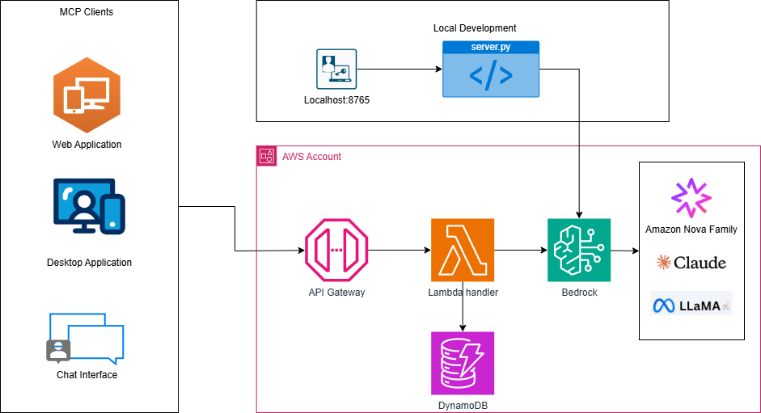

# AWS Serverless Customer Support Chatbot with Multi-Model Bedrock Support

This project demonstrates a **flexible, serverless customer support chatbot** that can leverage **any AWS Bedrock Foundation Model** including Amazon Nova, Anthropic Claude, Meta Llama, and others. Built with AWS Lambda, DynamoDB, API Gateway, and full **Model Context Protocol (MCP)** compliance.

## **Table of Contents**

- [Quick Start](#quick-start)
- [Key Highlights](#key-highlights)
- [Architecture Overview](#architecture-overview)
- [Supported Bedrock Models](#supported-bedrock-models)
- [Model Selection & Performance Guide](#model-selection--performance-guide)
- [Local Development](#local-development)
- [MCP Protocol Implementation](#mcp-protocol-implementation)
- [Project Structure](#project-structure)
- [Testing Your Deployment](#testing-your-deployment)
- [Advanced Configuration](#advanced-configuration)
- [Monitoring & Observability](#monitoring--observability)
- [Troubleshooting](#troubleshooting)
- [Best Practices](#best-practices)
- [Use Case Examples](#use-case-examples)
- [Additional Resources](#additional-resources)

## **Quick Start**

Get your multi-model AI chatbot running in **under 5 minutes**!

### **Prerequisites**
- AWS account with Bedrock model access enabled
- AWS CLI configured (`aws configure`)
- AWS SAM CLI installed ([Install Guide](https://docs.aws.amazon.com/serverless-application-model/latest/developerguide/install-sam-cli.html))

### **Deploy Your Chatbot**

#### **Option 1: Interactive Deployment (Recommended)**
```bash
# Clone and navigate
git clone <your-repo-url>
cd aws-mcp-chat-bot

# Interactive deployment (will prompt for model selection)
sam deploy --guided --stack-name aws-mcp-chatbot --capabilities CAPABILITY_IAM
```

#### **Option 2: Direct Model Selection**
```bash
# Deploy with Amazon Nova Lite (Default - Fast & Cost-Effective)
sam deploy --stack-name aws-mcp-chatbot --capabilities CAPABILITY_IAM

# Deploy with Claude Sonnet (Advanced reasoning)
sam deploy --stack-name aws-mcp-chatbot --capabilities CAPABILITY_IAM \
  --parameter-overrides BedrockModelId=anthropic.claude-3-5-sonnet-20241022-v2:0

# Deploy with Llama (Open-source preference)
sam deploy --stack-name aws-mcp-chatbot --capabilities CAPABILITY_IAM \
  --parameter-overrides BedrockModelId=meta.llama3-2-11b-instruct-v1:0
```

### **Test Your Deployment**
```bash
# Run comprehensive tests
.\test_mcp.ps1

# Compare model performance
.\test_models.ps1
```

### **What You Get**
- Production-ready serverless AI chatbot with auto-scaling
- Any Bedrock model of your choice (Nova, Claude, Llama)
- Full MCP compliance for easy integration
- Cost optimization - pay only for what you use

### **Next Steps**
1. **Get your API URL**: Check CloudFormation outputs
2. **Integrate with your app**: Use the `/mcp` endpoint
3. **Monitor costs**: Check AWS Cost Explorer
4. **Switch models**: Redeploy with different `BedrockModelId`

---

## **Key Highlights**

- **Multi-Model Flexibility**: Choose from Amazon Nova, Anthropic Claude, Meta Llama, and other Bedrock models
- **MCP Protocol Compliance**: Full adherence to MCP 2024-11-05 specification  
- **Dual Deployment**: Production AWS Lambda + Local WebSocket development server
- **Zero-Code Model Switching**: Change AI models via environment variables
- **Cost Optimization**: Select models based on performance and budget requirements
- **Future-Proof**: Ready for new Bedrock models as they're released
- **Enterprise Ready**: Full AWS security, IAM, and compliance features

## **Architecture Overview**

### **Flexible Multi-Model Design**





```
┌─────────────────────┐    
│   MCP Clients       │    
│ • Web Applications  │    
│ • Desktop Apps      │    
│ • Chat Interfaces   │    
└─────────────────────┘    
           │                
           ▼                
┌─────────────────────┐    ┌─────────────────────┐
│  Production Path    │    │  Development Path   │
│                     │    │                     │
│  API Gateway        │    │   WebSocket         │
│      POST /mcp      │    │   localhost:8765    │
│         │           │    │         │           │
│         ▼           │    │         ▼           │
│ mcp_lambda_handler  │    │   mcp_server.py     │
│      .py            │    │                     │
└─────────────────────┘    └─────────────────────┘
           │                            │
           └──────────┬─────────────────┘
                      ▼
         ┌─────────────────────────────────┐
         │      AWS Bedrock Models         │
         │ ┌─────────────────────────────┐ │
         │ │     Amazon Nova Family      │ │
         │ │ • nova-lite-v1:0 (Default)  │ │
         │ │ • nova-micro-v1:0           │ │
         │ │ • nova-pro-v1:0             │ │
         │ └─────────────────────────────┘ │
         │ ┌─────────────────────────────┐ │
         │ │   Anthropic Claude Family   │ │
         │ │ • claude-3-5-sonnet         │ │
         │ │ • claude-3-5-haiku          │ │
         │ │ • claude-3-opus             │ │
         │ └─────────────────────────────┘ │
         │ ┌─────────────────────────────┐ │
         │ │     Meta Llama Family       │ │
         │ │ • llama3-2-90b-instruct     │ │
         │ │ • llama3-2-11b-instruct     │ │
         │ │ • llama3-2-3b-instruct      │ │
         │ └─────────────────────────────┘ │
         │        + Other Models           │
         └─────────────────────────────────┘
                      │
                      ▼
           ┌─────────────────────┐
           │   AWS Services      │
           │ • DynamoDB Tables   │
           │ • Comprehend        │
           │ • CloudWatch        │
           └─────────────────────┘
```

### **Component Architecture**

| Component | Purpose | Environment | Protocol |
|-----------|---------|-------------|----------|
| **lambda_function/mcp_lambda_handler.py** | Production MCP server | AWS Lambda | HTTP + JSON-RPC 2.0 |
| **local/mcp_server.py** | Local development server | WebSocket | WebSocket + JSON-RPC 2.0 |
| **local/mcp_client.py** | Testing and integration | Local/Remote | Configurable |

## **Supported Bedrock Models**

### **Amazon Nova Family** (Recommended)
```yaml
# Fast and cost-effective (Default)
BedrockModelId: amazon.nova-lite-v1:0

# Ultra-fast responses for high-volume scenarios
BedrockModelId: amazon.nova-micro-v1:0

# High-quality responses for complex queries
BedrockModelId: amazon.nova-pro-v1:0
```

### **Anthropic Claude Family** 
```yaml
# Advanced reasoning and analysis
BedrockModelId: anthropic.claude-3-5-sonnet-20241022-v2:0

# Fast interactive responses
BedrockModelId: anthropic.claude-3-5-haiku-20241022-v1:0

# Premium model for complex tasks
BedrockModelId: anthropic.claude-3-opus-20240229-v1:0
```

### **Meta Llama Family**
```yaml
# Large model for complex reasoning
BedrockModelId: meta.llama3-2-90b-instruct-v1:0

# Balanced performance and efficiency
BedrockModelId: meta.llama3-2-11b-instruct-v1:0

# Efficient model for standard queries
BedrockModelId: meta.llama3-2-3b-instruct-v1:0

# Lightweight model for simple tasks
BedrockModelId: meta.llama3-2-1b-instruct-v1:0
```

## **Model Selection & Performance Guide**

### **Recommended Models by Use Case**
| Use Case | Recommended Model | Reason | Cost Level | Latency |
|----------|------------------|---------|------------|---------|
| **High Volume, Cost-Sensitive** | `amazon.nova-micro-v1:0` | Fastest, most cost-effective | $ | ~200ms |
| **Balanced Performance** | `amazon.nova-lite-v1:0` | Good balance of speed/quality | $$ | ~500ms |
| **Premium Quality** | `amazon.nova-pro-v1:0` | High-quality responses | $$$ | ~1s |
| **Complex Reasoning** | `anthropic.claude-3-5-sonnet-20241022-v2:0` | Advanced reasoning capabilities | $$$$ | ~2s |
| **Fast Interactive** | `anthropic.claude-3-5-haiku-20241022-v1:0` | Quick responses | $$$ | ~800ms |
| **Open Source Preference** | `meta.llama3-2-11b-instruct-v1:0` | Meta's proven model | $$$ | ~1.5s |

### **Cost & Performance Overview**
- **Most Cost-Effective**: Nova Micro → Nova Lite → Llama 11B
- **Fastest Response**: Nova Micro → Nova Lite → Claude Haiku  
- **Best Reasoning**: Claude Sonnet → Nova Pro → Llama 11B
- **Best Balance**: Nova Lite (recommended for most use cases)

## **Local Development**

### **Start Local Development Server**
```bash
# Set your preferred model for local development
export BEDROCK_MODEL_ID=amazon.nova-lite-v1:0

# Start the local MCP WebSocket server
python mcp_server.py
```

### **Test with MCP Client**
```bash
# Start interactive MCP client (connects to local server)
python mcp_client.py

# The client provides:
# 1. Interactive CLI for testing
# 2. MCP protocol validation
# 3. Real-time debugging
```

### **Switch Models for Testing**
```bash
# Test with different models locally
export BEDROCK_MODEL_ID=anthropic.claude-3-5-haiku-20241022-v1:0
python mcp_server.py

# Test with Llama
export BEDROCK_MODEL_ID=meta.llama3-2-3b-instruct-v1:0
python mcp_server.py
```

## **MCP Protocol Implementation**

### **Full MCP 2024-11-05 Specification**
- **Tools**: AI-powered conversation tools
- **Resources**: Access to conversation history and data
- **Prompts**: Pre-configured customer support scenarios
- **Sampling**: Direct AI model interaction
- **JSON-RPC 2.0**: Standard protocol compliance

### **Available MCP Tools**

#### **1. chat_with_ai Tool**
```json
{
  "name": "chat_with_ai",
  "description": "Chat with configurable Bedrock AI model for customer support",
  "inputSchema": {
    "type": "object",
    "properties": {
      "message": {"type": "string", "description": "User message"},
      "conversation_id": {"type": "string", "description": "Conversation ID"},
      "user_id": {"type": "string", "description": "User identifier"}
    },
    "required": ["message"]
  }
}
```

#### **2. get_conversation_history Tool**
```json
{
  "name": "get_conversation_history",
  "description": "Retrieve conversation history for context",
  "inputSchema": {
    "type": "object",
    "properties": {
      "conversation_id": {"type": "string", "description": "Conversation ID"}
    },
    "required": ["conversation_id"]
  }
}
```

### **MCP Resources**
- **conversations://history/{conversation_id}**: Individual conversation history
- **conversations://list**: List of all conversations  
- **conversations://metadata/{conversation_id}**: Conversation metadata

### **MCP Prompts**
- **customer_support**: General customer support assistant
- **password_reset_help**: Specialized password reset guidance
- **technical_support**: Technical issue resolution

## **Project Structure**

```
aws-mcp-chat-bot/
├── .aws-sam/                     # AWS SAM build artifacts
├── .git/                         # Git repository metadata
├── extra/                        # Additional resources and documentation
│   └── architecture.png          # Architecture diagram
├── src/                          # Source code directory
│   ├── lambda_function/          # Production Lambda function
│   │   └── mcp_lambda_handler.py # Main Lambda MCP server
│   ├── local/                    # Local development tools
│   │   ├── mcp_server.py         # Local WebSocket MCP server
│   │   └── mcp_client.py         # MCP client for testing
│   └── requirements.txt          # Python dependencies
├── test_essentials/              # Testing and validation
│   ├── test_events.json          # Lambda test events
│   ├── test_events_bedrock.json  # Bedrock-specific test events
│   ├── test_events_models.json   # Model comparison test events
│   ├── test_events_nova.json     # Nova model test events
│   ├── test_mcp.json             # MCP protocol test events
│   ├── test_mcp_complete.json    # Complete MCP test suite
│   ├── test_mcp.ps1              # PowerShell MCP test script
│   └── test_models.ps1           # PowerShell model comparison script
├── .gitignore                    # Git ignore patterns
├── .samignore                    # SAM ignore patterns
├── README.md                     # This comprehensive guide
├── sample_api_requests.json      # Sample API request examples
├── samconfig.toml                # SAM configuration
└── template.yaml                 # AWS SAM deployment template
```

## **Testing Your Deployment**

### **Test MCP Protocol**
```powershell
# Run comprehensive MCP protocol tests
.\test_mcp.ps1

# When prompted, enter your API Gateway URL:
# https://your-api-id.execute-api.us-east-1.amazonaws.com/dev
```

### **Manual API Testing**
```bash
# Get your API endpoint
aws cloudformation describe-stacks --stack-name aws-mcp-chatbot \
  --query 'Stacks[0].Outputs[?OutputKey==`MCPApiUrl`].OutputValue' --output text

# Test MCP initialize
curl -X POST https://your-api-id.execute-api.us-east-1.amazonaws.com/dev/mcp \
  -H "Content-Type: application/json" \
  -d '{
    "jsonrpc": "2.0",
    "id": "1",
    "method": "initialize",
    "params": {
      "protocolVersion": "2024-11-05",
      "capabilities": {},
      "clientInfo": {"name": "Test Client", "version": "1.0"}
    }
  }'

# Test chat tool
curl -X POST https://your-api-id.execute-api.us-east-1.amazonaws.com/dev/mcp \
  -H "Content-Type: application/json" \
  -d '{
    "jsonrpc": "2.0",
    "id": "2",
    "method": "tools/call",
    "params": {
      "name": "chat_with_ai",
      "arguments": {
        "message": "Hello, I need help with my account",
        "conversation_id": "test_conv_001",
        "user_id": "test_user_123"
      }
    }
  }'
```

## **Advanced Configuration**

### **Environment Variables**

#### **Production (Lambda)**
```yaml
# Set in template.yaml
Environment:
  Variables:
    BEDROCK_MODEL_ID: !Ref BedrockModelId
    CONVERSATIONS_TABLE: !Ref MCPConversationsTable
```

#### **Local Development**
```bash
# Core configuration
export BEDROCK_MODEL_ID=amazon.nova-lite-v1:0
export AWS_REGION=us-east-1

# Optional performance tuning
export MCP_MAX_TOKENS=500
export MCP_TEMPERATURE=0.7
export MCP_TOP_P=0.9
```

### **Model-Specific Optimizations**

#### **Amazon Nova Models**
```python
# Optimized for Nova response format
{
  "messages": messages,
  "max_tokens": 500,
  "temperature": 0.7,
  "top_p": 0.9
}
```

#### **Claude Models**
```python  
# Optimized for Claude reasoning
{
  "messages": messages,
  "max_tokens": 1000,
  "temperature": 0.3,
  "top_p": 0.95
}
```

#### **Llama Models**
```python
# Optimized for Llama performance
{
  "messages": messages,
  "max_tokens": 800,
  "temperature": 0.8,
  "top_p": 0.9
}
```

## **Monitoring & Observability**

### **CloudWatch Metrics**
```bash
# Monitor Lambda performance
aws logs tail /aws/lambda/aws-mcp-chatbot-MCPServerFunction --follow

# Monitor model performance
aws cloudwatch get-metric-statistics \
  --namespace AWS/Bedrock \
  --metric-name InvocationsCount \
  --dimensions Name=ModelId,Value=amazon.nova-lite-v1:0 \
  --start-time 2025-01-01T00:00:00Z \
  --end-time 2025-01-02T00:00:00Z \
  --period 3600 \
  --statistics Sum
```

### **Cost Monitoring**
```bash
# Monitor Bedrock costs
aws ce get-cost-and-usage \
  --time-period Start=2025-01-01,End=2025-01-02 \
  --granularity DAILY \
  --metrics BlendedCost \
  --group-by Type=DIMENSION,Key=SERVICE
```

## **Troubleshooting**

### **Common Issues**

#### **Model Access Denied**
```bash
# Solution: Enable model access in Bedrock console
aws bedrock get-foundation-model --model-identifier amazon.nova-lite-v1:0

# If fails, go to AWS Console > Bedrock > Model access > Request access
```

#### **Unsupported Model Format**
```bash
# Check model availability in your region
aws bedrock list-foundation-models --by-provider amazon --region us-east-1

# Update to supported model ID
sam deploy --parameter-overrides BedrockModelId=amazon.nova-lite-v1:0
```

#### **High Latency**
```bash
# Switch to faster model
sam deploy --parameter-overrides BedrockModelId=amazon.nova-micro-v1:0

# Or optimize for your region
sam deploy --parameter-overrides Region=us-west-2
```

#### **Cost Concerns**
```bash
# Switch to more cost-effective model
sam deploy --parameter-overrides BedrockModelId=amazon.nova-micro-v1:0

# Monitor usage
aws ce get-cost-and-usage --time-period Start=2025-01-01,End=2025-01-02
```

### **Debug Commands**
```bash
# Validate SAM template
sam validate

# Check deployment status
aws cloudformation describe-stacks --stack-name aws-mcp-chatbot

# Test local model access
python -c "
import boto3
bedrock = boto3.client('bedrock-runtime')
response = bedrock.invoke_model(
    modelId='amazon.nova-lite-v1:0',
    body='{\"messages\":[{\"role\":\"user\",\"content\":\"Hello\"}],\"max_tokens\":100}',
    contentType='application/json'
)
print('Model access successful!')
"
```

## **Best Practices**

### **Model Selection Strategy**
1. **Start with Nova Lite**: Good balance of cost and quality
2. **Scale up for complexity**: Use Claude Sonnet for advanced reasoning
3. **Scale down for volume**: Use Nova Micro for high-traffic scenarios
4. **Test multiple models**: Compare performance for your specific use case

### **Cost Optimization**
1. **Use appropriate model sizes**: Don't over-engineer for simple queries
2. **Implement caching**: Cache frequent responses to reduce API calls
3. **Monitor usage**: Set up CloudWatch alarms for cost thresholds
4. **Optimize prompts**: Shorter, more specific prompts reduce token usage

### **Performance Optimization**
1. **Choose regional endpoints**: Deploy in regions closest to your users
2. **Implement connection pooling**: Reuse Lambda containers when possible
3. **Use appropriate timeouts**: Set realistic timeouts for different models
4. **Implement graceful degradation**: Fallback to simpler models if needed

## **Use Case Examples**

### **High-Volume Customer Support**
```yaml
# Recommended configuration
BedrockModelId: amazon.nova-micro-v1:0
LambdaConcurrency: 1000
DynamoDBBillingMode: ON_DEMAND
```

### **Complex Technical Support**
```yaml
# Recommended configuration  
BedrockModelId: anthropic.claude-3-5-sonnet-20241022-v2:0
LambdaTimeout: 120
MaxTokens: 1500
```

### **Multi-Language Support**
```yaml
# Recommended configuration
BedrockModelId: meta.llama3-2-11b-instruct-v1:0
Languages: [en, es, fr, de, it]
```

### **Enterprise Deployment**
```yaml
# Recommended configuration
BedrockModelId: amazon.nova-pro-v1:0
Environment: Production
Monitoring: Enhanced
BackupRetention: 30days
```

## **Additional Resources**

- **[AWS Bedrock Documentation](https://docs.aws.amazon.com/bedrock/)**
- **[Model Context Protocol Specification](https://modelcontextprotocol.io/)**
- **[AWS SAM Developer Guide](https://docs.aws.amazon.com/serverless-application-model/)**
- **[Bedrock Model Pricing](https://aws.amazon.com/bedrock/pricing/)**

---

**Ready to deploy your multi-model AI chatbot? Choose your preferred Bedrock model and deploy in minutes!**

```bash
# Quick start with recommended model
sam deploy --guided --stack-name aws-mcp-chatbot --capabilities CAPABILITY_IAM
```
